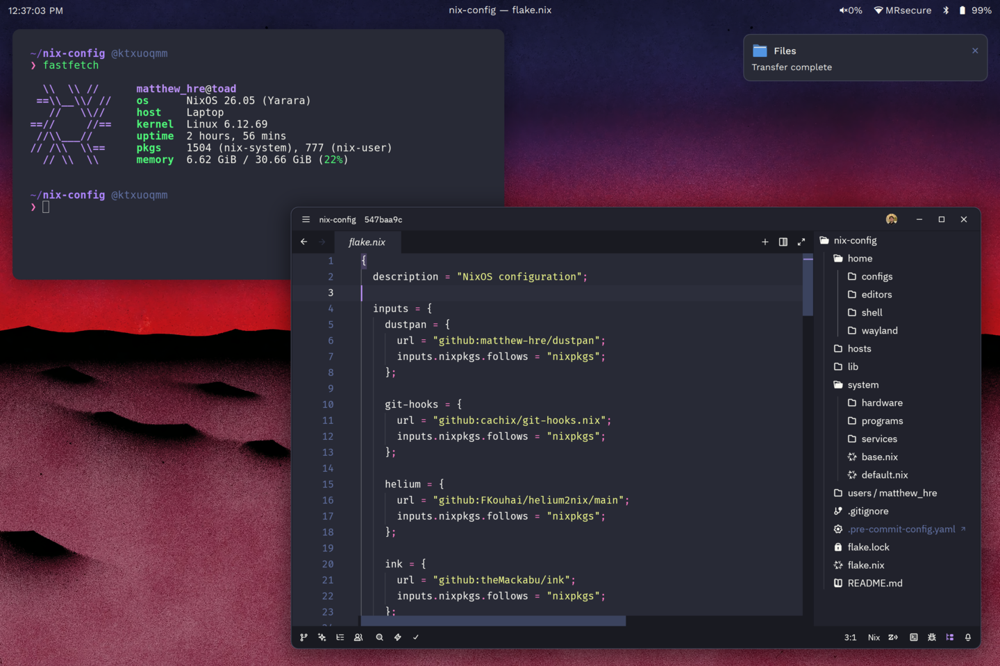

# My NixOS Configuration

[](https://nixos.org)
[](https://github.com/YaLTeR/niri)



This is my NixOS configuration for both my desktop and laptop.

> This config is a **nightmare**. I would not wish this upon my worst enemies.
> Please, for the love of god, do not use this as a template for your own NixOS
> configuration. This is directed to the 9 people who have this repo starred.

## Overview

|                           | thwomp (Desktop)                                                      | toad (Laptop, Framework 13")                                          |
| ------------------------- | --------------------------------------------------------------------- | --------------------------------------------------------------------- |
| **DE / WM**               | Niri                                                                  | Niri                                                                  |
| **Bar and Notifications** | [Custom Quickshell](https://github.com/matthew-hre/quickshell-config) | [Custom Quickshell](https://github.com/matthew-hre/quickshell-config) |
| **Launcher**              | Vicinae                                                               | Vicinae                                                               |
| **Shell**                 | fish + Tide                                                           | fish + Tide                                                           |
| **Editor**                | Helix + Zed                                                           | Helix + Zed                                                           |
| **Terminal**              | Ghostty                                                               | Ghostty                                                               |
| **Browser**               | Helium                                                                | Helium                                                                |

### Quickshell

The Wayland bar on **toad** is powered by [Quickshell](https://git.outfoxxed.me/outfoxxed/quickshell), a Qt6/QML-based shell toolkit. My config lives in a separate repo: [matthew-hre/quickshell-config](https://github.com/matthew-hre/quickshell-config). It's launched at startup by Niri and handles my notifications.

### Editors

**Helix** is the primary terminal editor, configured with Dracula, inlay hints, and LSP messages enabled. **Zed** handles GUI editing — it's built from source via the flake input and wrapped in an FHS environment (for extension deps like `openssl`/`zlib`). Both share a common set of language servers managed in `home/editors/language-servers.nix`.

## Structure

```
.
├── home/           # User-level configuration (Home Manager)
│   ├── configs/    # CLI tools (bat, btop, git, yazi, direnv, etc.)
│   ├── editors/    # Editor configs (Helix, Zed, NVF, VSCode)
│   ├── shell/      # Shell setup (fish + Tide, Ghostty)
│   └── wayland/    # Wayland environment (Niri, Quickshell, etc.)
├── hosts/          # Per-machine configuration
│   ├── thwomp/     # Desktop — Niri + Quickshell
│   └── toad/       # Laptop — Niri + Quickshell
├── lib/            # Helper functions (mkHost)
├── system/         # System-level modules
│   ├── hardware/   # AMD GPU/CPU, Bluetooth, fingerprint reader, fwupd
│   ├── programs/   # Discord, Steam, fonts, Niri, XDG
│   └── services/   # greetd, PipeWire, Docker, OpenSSH, power mgmt, VPN
└── users/          # User account definitions
```

Hosts are built with a `mkHost` helper in `lib/` that wires up Home Manager, injects flake inputs as `specialArgs`, and merges per-host modules. The formatter is `alejandra`, enforced via a `pre-commit` hook.

## Systems

### Thwomp (Desktop)

- **CPU**: AMD Ryzen 7 9700X
- **GPU**: AMD Radeon RX 7800 XT
- **RAM**: 32 GB DDR5
- **Storage**: 1 TB NVMe SSD Boot + 2 TB NVMe SSD Steam Drive
- **Display**: 32" UltraWide 1440p Monitor + 27" 1440p Monitor

### Toad (Laptop)

- **Model**: Framework Laptop 13" (2024)
- **CPU**: AMD Ryzen 7 7840U
- **GPU**: Integrated
- **RAM**: 32 GB DDR5
- **Storage**: 1 TB NVMe SSD
